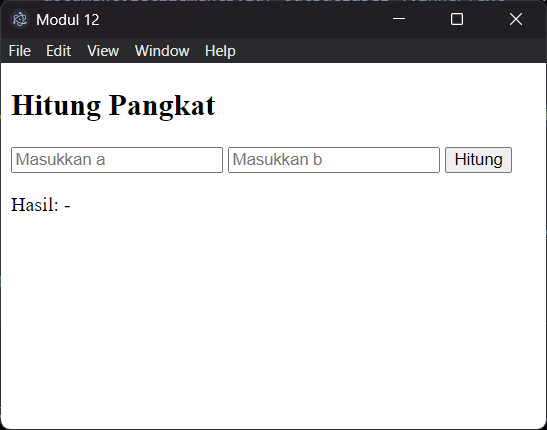
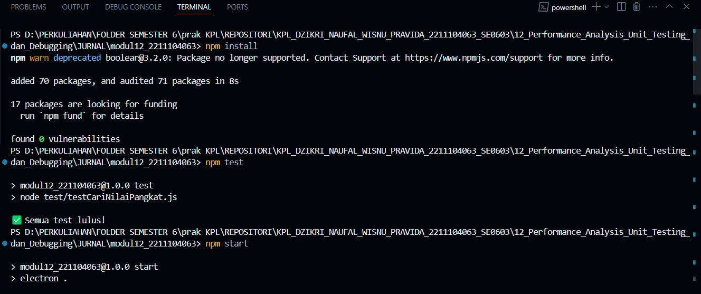

<h2>Nama : Dzikri Naufal Wisnu Pravida</h2>
<h2>NIM: 2211104063</h2>
<h2>Kelas : SE-06-03</h2>

<h3>JURNAL Modul 12</h3>

### JURNAL

- Source Code index.html

```
<!DOCTYPE html>
<html>
<head>
  <title>Modul 12</title>
</head>
<body>
  <h2>Hitung Pangkat</h2>
  <input id="baseInput" type="number" placeholder="Masukkan a">
  <input id="exponentInput" type="number" placeholder="Masukkan b">
  <button id="hitungBtn">Hitung</button>
  <p>Hasil: <span id="outputLabel">-</span></p>

  <script src="renderer.js"></script>
</body>
</html>

```

- Source Code main.js

```
const { app, BrowserWindow } = require('electron');
const path = require('path');

function createWindow() {
  const win = new BrowserWindow({
    width: 450,
    height: 350,
    webPreferences: {
      preload: path.join(__dirname, 'preload.js'),
      contextIsolation: true,
      nodeIntegration: false
    }
  });

  win.loadFile('index.html');
}

app.whenReady().then(createWindow);

```

- Source Code package.json

```
{
  "name": "modul12_221104063",
  "version": "1.0.0",
  "main": "main.js",
  "scripts": {
    "start": "electron .",
    "test": "node test/testCariNilaiPangkat.js"
  },
  "devDependencies": {
    "electron": "^27.0.0"
  }
}
```

- Source Code preload.js

```
const { contextBridge } = require('electron');
const { cariNilaiPangkat } = require('./utils');

contextBridge.exposeInMainWorld('api', {
  pangkat: cariNilaiPangkat
});

```

- Source Code renderer.js

```
window.addEventListener('DOMContentLoaded', () => {
  const tombol = document.getElementById('hitungBtn');

  tombol.addEventListener('click', () => {
    const a = document.getElementById('baseInput').value;
    const b = document.getElementById('exponentInput').value;

    if (!a || !b) {
      document.getElementById('outputLabel').innerText = 'Mohon isi semua input!';
      return;
    }

    if (!window.api || !window.api.pangkat) {
      document.getElementById('outputLabel').innerText = 'Error: preload gagal!';
      return;
    }

    const hasil = window.api.pangkat(a, b);
    document.getElementById('outputLabel').innerText = `Hasil: ${hasil}`;
  });
});


```

- Source Code test/testCariNilaiPangkat.js

```
const assert = require('assert');
const { cariNilaiPangkat } = require('../utils');

try {
  assert.strictEqual(cariNilaiPangkat(2, 3), 8);
  assert.strictEqual(cariNilaiPangkat(0, 0), 1);
  assert.strictEqual(cariNilaiPangkat(4, -2), -1);
  assert.strictEqual(cariNilaiPangkat(101, 3), -2);
  assert.strictEqual(cariNilaiPangkat(2, 11), -2);
  assert.strictEqual(cariNilaiPangkat(9, 30), -3);
  console.log("✅ Semua test lulus!");
} catch (e) {
  console.error("❌ Test gagal:", e.message);
}


```

- Berikut ini output code tersebut: <br>
  
  

- Program ini adalah aplikasi GUI desktop berbasis JavaScript menggunakan Electron.js untuk menyelesaikan soal Jurnal Modul 12. Aplikasi menampilkan dua textbox untuk menerima input angka a dan b, sebuah tombol untuk memproses, serta label untuk menampilkan hasil. Fungsi cariNilaiPangkat(a, b) dibuat secara manual menggunakan perulangan tanpa fungsi bawaan, serta menerapkan aturan khusus seperti: return 1 jika b = 0, -1 jika b < 0, -2 jika b > 10 atau a > 100, dan -3 jika hasil melebihi batas integer aman (Number.MAX_SAFE_INTEGER). Unit test disiapkan untuk mencakup semua kondisi percabangan fungsi. Profiling penggunaan CPU dan memori dapat dilakukan melalui Task Manager saat program dijalankan dan diberikan input. Hasil, source code, dan laporan screenshot bisa dikompilasi menjadi file ZIP sesuai format pengumpulan.
