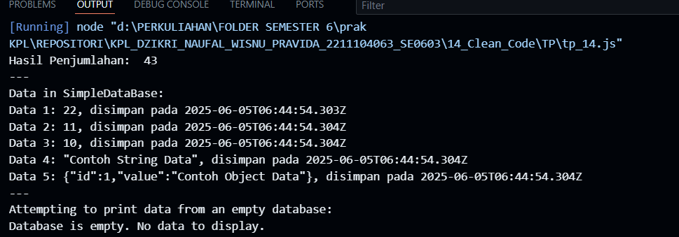

<h2>Nama : Dzikri Naufal Wisnu Pravida</h2>
<h2>NIM: 2211104063</h2>
<h2>Kelas : SE-06-03</h2>

<h3>TP Modul 13</h3>

### TP

- Source Code index.html

```
/**
 * @file Refactored JurnalModul5.js
 * @description This file contains refactored code for Penjumlahan and SimpleDataBase classes
 * according to Modul 14 guidelines.
 */

// 1. Class for summing three numbers
/**
 * @class Penjumlahan
 * @description A utility class with a static method to calculate the sum of three numbers.
 */
class Penjumlahan {
    /**
     * Calculates the sum of three numbers.
     * It explicitly converts parameters to numbers before summation to ensure correct arithmetic,
     * especially if inputs might be string representations of numbers.
     * @static
     * @param {number|string} num1 - The first number or its string representation.
     * @param {number|string} num2 - The second number or its string representation.
     * @param {number|string} num3 - The third number or its string representation.
     * @returns {number} The sum of the three numbers.
     */
    static jumlahTigaAngka(num1, num2, num3) {
        // Explicitly convert parameters to numbers
        return Number(num1) + Number(num2) + Number(num3);
    }
}

// Example usage for Penjumlahan class
// Demonstrating with example numbers (e.g., from a NIM: 22, 11, 10)
let hasilPenjumlahan = Penjumlahan.jumlahTigaAngka(22.0, 11.0, 10.0);
console.log("Hasil Penjumlahan: ", hasilPenjumlahan);

console.log("---"); // Separator for better output readability

// 2. Generic class for a simple database
/**
 * @class SimpleDataBase
 * @template T
 * @description A simple generic database class to store various types of data
 * along with the timestamp of their addition.
 */
class SimpleDataBase {
    /**
     * Initializes a new instance of SimpleDataBase.
     * `storedData` array will hold the actual data entries.
     * `inputDates` array will hold the ISO timestamp string for when each corresponding data entry was added.
     */
    constructor() {
        /** @type {Array<T>} Data storage array */
        this.storedData = [];
        /** @type {Array<string>} Timestamp storage array */
        this.inputDates = []; // Stores ISO date strings
    }

    /**
     * Adds new data to the database and records the current timestamp.
     * @param {T} data - The data item to be added to the database.
     */
    addNewData(data) {
        this.storedData.push(data);
        this.inputDates.push(new Date().toISOString()); // Record timestamp in ISO format
    }

    /**
     * Prints all data entries to the console, including the data itself
     * and the timestamp when it was stored.
     * If the database is empty, it prints a corresponding message.
     */
    printAllData() {
        if (this.storedData.length === 0) {
            console.log("Database is empty. No data to display.");
            return;
        }

        console.log("Data in SimpleDataBase:");
        this.storedData.forEach((data, index) => {
            // Using template literal for clear and formatted output
            console.log(`Data ${index + 1}: ${JSON.stringify(data)}, disimpan pada ${this.inputDates[index]}`);
        });
    }
}

// Example usage for SimpleDataBase class
let simpleDb = new SimpleDataBase(); // Renamed 'db' to 'simpleDb' for clarity
simpleDb.addNewData(22.0);
simpleDb.addNewData(11.0);
simpleDb.addNewData(10.0);
simpleDb.addNewData("Contoh String Data"); // Demonstrating generic nature with string data
simpleDb.addNewData({ id: 1, value: "Contoh Object Data" }); // Demonstrating with object data
simpleDb.printAllData();

console.log("---");

// Example demonstrating an empty database output
let emptyDb = new SimpleDataBase();
console.log("Attempting to print data from an empty database:");
emptyDb.printAllData();

```

- Source Code main.js

```
const { app, BrowserWindow } = require('electron');
const path = require('path');

function createWindow() {
  const win = new BrowserWindow({
    width: 400,
    height: 300,
    webPreferences: {
      preload: path.join(__dirname, 'preload.js')
    }
  });

  win.loadFile('index.html');
}

app.whenReady().then(createWindow);

```

- Berikut ini output code tersebut: <br>
  

- A. Naming Convention
  Sesuai dengan konvensi umum JavaScript (mirip dengan standar yang diisyaratkan seperti .NET untuk C# dalam hal kejelasan):

Variables / Properties / Attributes:
Variabel hasil diubah menjadi hasilPenjumlahan agar lebih deskriptif mengenai nilai yang disimpannya.
Variabel db diubah menjadi simpleDb agar lebih jelas merepresentasikan instance dari SimpleDataBase.
Nama properti seperti storedData dan inputDates sudah menggunakan camelCase dan cukup deskriptif, sehingga dipertahankan.
Method / Function / Procedure:
Nama method seperti jumlahTigaAngka, addNewData, dan printAllData sudah menggunakan camelCase dan deskriptif, sehingga dipertahankan.
Parameter method jumlahTigaAngka yang semula a, b, c diubah menjadi num1, num2, num3. Meskipun a, b, c singkat, num1, num2, num3 sedikit lebih eksplisit mengenai ekspektasi input sebagai angka.
Nama class Penjumlahan dan SimpleDataBase sudah menggunakan PascalCase, yang merupakan konvensi standar untuk nama kelas, dan dipertahankan.
B. White space dan indentation
Indentation: Kode secara konsisten menggunakan 4 spasi untuk indentasi, meningkatkan keterbacaan.
White Space:
Spasi yang konsisten digunakan di sekitar operator (=, +, =>), setelah koma, dan di antara parameter fungsi.
Baris kosong digunakan secara strategis untuk memisahkan blok logika (misalnya, antara definisi kelas dan contoh penggunaannya, atau antara metode dalam kelas), yang membantu dalam mengorganisir kode secara visual.
Output console.log("---"); ditambahkan untuk memisahkan output dari contoh penggunaan yang berbeda, meningkatkan kejelasan saat menjalankan kode.
Dalam method printAllData, JSON.stringify(data) digunakan untuk memastikan output data objek juga tercetak dengan baik.
C. Variable/ attribute declarations
Deklarasi Variabel: Penggunaan let untuk deklarasi variabel seperti hasilPenjumlahan dan simpleDb dipertahankan, karena let menyediakan block scope yang lebih aman dibandingkan var.
Deklarasi Atribut Kelas:
Atribut kelas (storedData dan inputDates di SimpleDataBase) dideklarasikan dan diinisialisasi di dalam constructor. Ini adalah praktik standar.
Komentar JSDoc ditambahkan untuk properti ini (misalnya, /\*_ @type {Array<T>} _/) untuk memberikan petunjuk tipe, yang meningkatkan kejelasan tentang data apa yang diharapkan untuk disimpan, meskipun JavaScript adalah bahasa yang diketik secara dinamis.
D. Comments
JSDoc Comments: Komentar dokumentasi (JSDoc style) ditambahkan untuk setiap kelas dan metode. Ini menjelaskan:
Tujuan dari kelas/metode tersebut.
Parameter yang diterima oleh metode (@param), termasuk tipe data yang diharapkan.
Nilai yang dikembalikan oleh metode (@returns).
Untuk kelas generik seperti SimpleDataBase, @template T digunakan untuk menandakan tipe generik.
Inline Comments:
Komentar inline ditambahkan pada baris-baris kode yang mungkin memerlukan penjelasan tambahan, misalnya, alasan konversi Number() pada jumlahTigaAngka atau penggunaan toISOString() pada addNewData.
Komentar seperti // 1. Membuat class... yang lebih bersifat instruksional dari file asli telah diintegrasikan atau digantikan dengan JSDoc yang lebih formal atau komentar penjelasan yang relevan.
Komentar untuk "Contoh penggunaan" dipertahankan dan disesuaikan agar tetap relevan dengan kode yang direfaktor.
